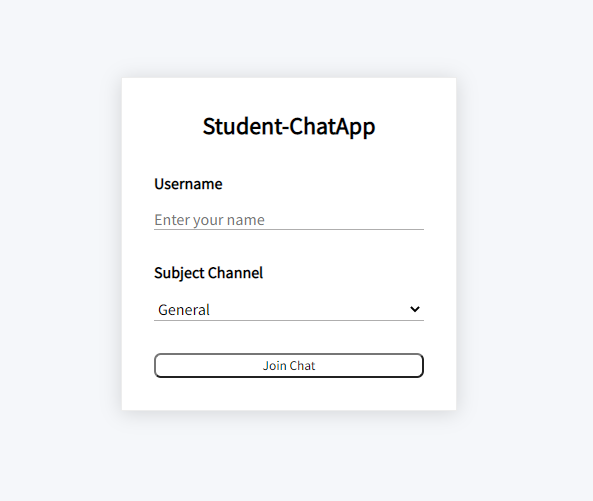

# Student Chat app

Multiple students can chat with different subject Channels.

```python
Tech stack used -

Frontend - HTML, CSS, Javascript
Backend - Nodejs, Express & Socket-io
```

## Login into Chat-Room

Here students need to enter the name & choose the subject channel from the subject channel dropdown list. Click on the Join Chat button then he will move to the chat channel.



## Chat Room

Here students can see the channel name & user present on the channel in the left side bar. students can see the messages regards the channel in the right sidebar. Students can type to message & send into the group by clicking on the send button. to leave the room just click on the Leave Channel button.


